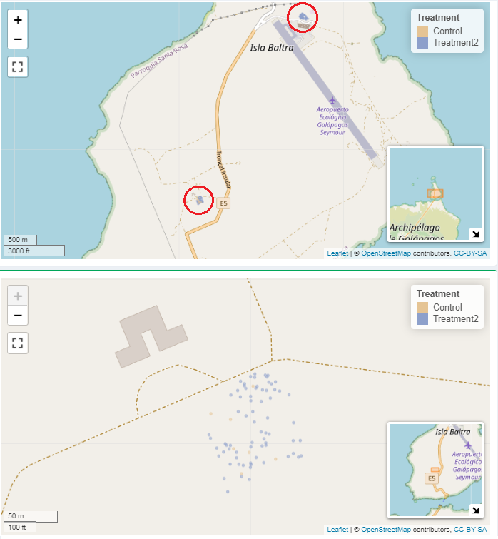

ESta herramienta nos permite resumir y visualizar los análisis estadísticos, facilitando la comprensión sobre qué tratamiento funcionan mejor para aumentar la supervivencia de las plantas después de plantarlas. Esto muy importante para comprtir con las partes interesadas y otros científicos para mostrar lo que funciona y lo que no.

Para utilizar esta herramienta se debe especificar:
+ Un rango de fechas 
+ Una o varias de las especies de plantas que el proyecto usa para restauración.
+ Uno o más de los cuatro tipos de tratamiento (WaterBox, Coccon, GrowBox, Control) 
+ Uno o más sitios de siembra

#### Resultados

Una vez definido las fechas, las especies, los tratamiento y los sitios, tres recuadros en pantalla muestran la datos del número de individuos sembrados según esas especificaciones.

También es posible visualizar el gráfico de un análisis estadístico de supervivencia de Kaplan-Meier, donde muestra la probabilidad de supervivencia en el tiempo de los invidudos plantados, de las especies seleccionadas, desde que se sembraron y según el tratamiento escogido.

Más abajo se presenta un mapa con los sitios de siembra que se escogieron y donde se muestra la ubicación de los invididuos sembrados, de diferente color según el tratamiento seleccionado.

En la parte inferior hay un sección para conocer las jornadas de trabajo de campo que ha realizado el equipo de GV2050. Si seleccionamos un año de interés se nos muestra en un diagrama con todos los días del año seleccionado, en los cuales se realizaron actividades en el campo.

Por último, en la sección final, de igual manera si seleccionamos un año, un tabla nos muestra un resumen anual de la época del año en las que el proyecto trabajó en determinadas islas.

