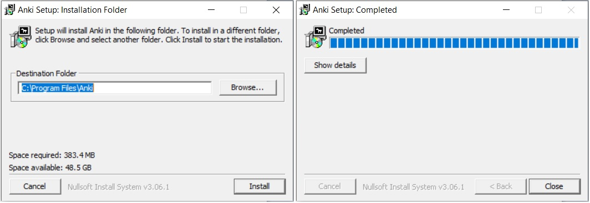
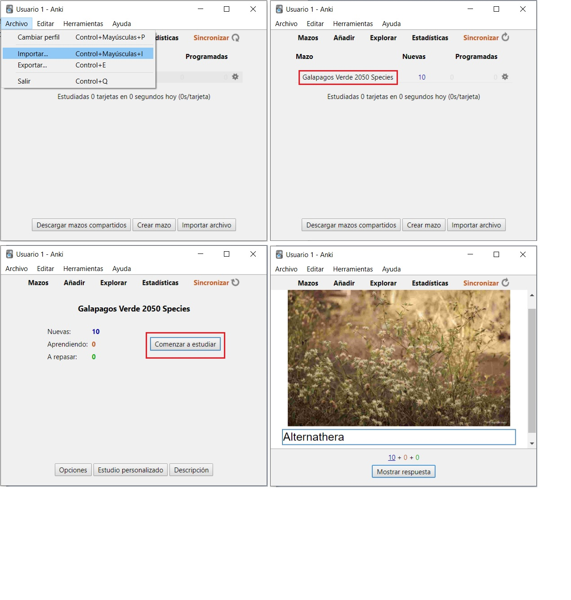

## ¿Qué es Anki?

Anki es un programa para memorizar utilizando tarjetas que facilita el recuerdo de las cosas. Utiliza la técnica de la repetición espaciada, debido a que es mucho más eficiente que los métodos de estudio tradicionales, puede disminuir en gran medida el tiempo dedicado a estudiar o aumentar en gran medida la cantidad que aprende.

En el proyecto GV2050, este programa se ha adecuado para facilitar el aprendizaje e identificación de las especies de plantas, tanto las que se usan en el proceso de restauración, como toda la flora endémica, nativa e introducida del archipiélago.

## ¿Cómo instalar Anki?

El primer paso es ir a la siguiente dirección web y descargar la versión del programa correspondiente con el sistema operativo de tu PC: [https://apps.ankiweb.net/](https://apps.ankiweb.net/)

Una vez descargado el archivo .exe, ejecutarlo y proceder con la instalación.

Después de la instalación, se debe crear una cuenta (Nombre de usuario + contraseña). Para esto se debe dar click en Sincronizar en la pantalla principal y seleccionar registrarse. Esta acción te llevará a un portal web donde se debe proceder con el registro.

Para usar Anki se necesita un archivo compatible que contiene tarjetas de memoria. El proyecto GV2050 ha generado un paquete de tarjetas propio sobre las especies de plantas endémicas y nativas que se utilizan en nuestras actividades de restauración ecológica. Desde Anki en la pestaña archivo se selecciona Importar para subir el paquete de cartas de las especies anteriormente descargado. Por último, solo se debe reiniciar el programa y las imágenes se subirán automáticamente, y ya está listo para funcionar. [(Enlace de descarga)](/docs/HD_Anki/GV2050_Anki.apkg)

También se encuentra disponible la Version 2 del paquete con más especies de plantas que se encuentran en Galápagos, no solamente nativas y endémicas que se usan en el proyecto, si no también especies introducidas.[(Enlace de descarga)](/docs/HD_Anki/GV2050_AnkiV2.0.apkg)
