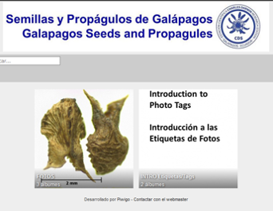
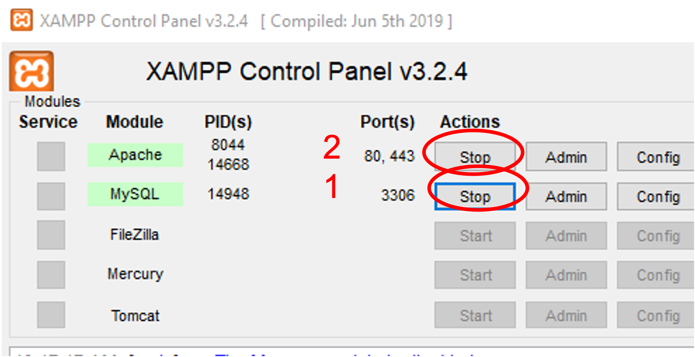

## ¿Qué es Piwigo?

Piwigo es un software de galería de fotos para la web que cuenta con potentes funciones para publicar y administrar su colección de imágenes.

## ¿Cómo usar la galería de semillas?

El equipo de Galápagos Verde 2050 utiliza esta herramienta digital para organizar y acceder fácilmente a la base de datos de fotos de semillas de especies de Galápagos. Es de gran utilidad a la hora de identificar semillas. En el buscador se pueden buscar especies utilizando palabras claves como x, y, z. La base de datos de fotos que utiliza el programa se encuentra en dentro del dispositivo de almacenamiento <b>Drobo</b>, ubicado físicamente en la oficinas del GV2050, y se ha adecuado para que Piwigo permita la visualización de las fotos en equipos conectados a la red de la CDRS. 

 Para acceder a esta colección de fotos primero se deben iniciar los servidores Apache y MySQL utilizando el programa XAMPP en la computadora del Herbario. 

Una vez iniciados los servidores, se podrá acceder a la galería desde cualquier computadora conectada a la red de la CDRS utilizando los siguientes urls:

+ [http://piwigo.fcdarwin.org.ec/](http://piwigo.fcdarwin.org.ec/)
+ [http://192.168.100.168/piwigo](http://192.168.100.168/piwigo)
+ [localhost/piwigo/](localhost/piwigo/) (solo en computadora del Herbario)

Al acabar de utilizar la galería se debe apagar los servidores utilizando el programa XAMPP.

