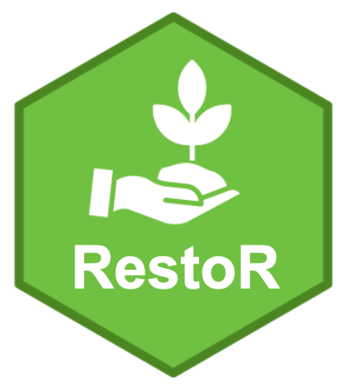
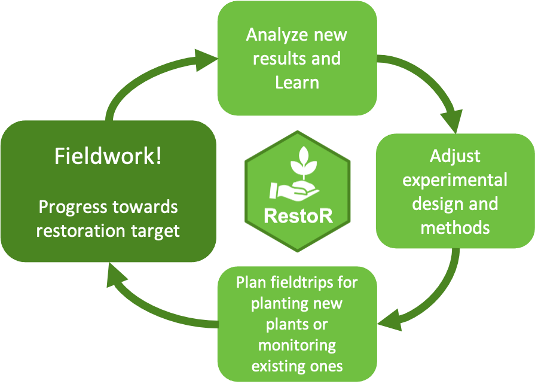

Enlace hacía la aplicación [(Click aquí)](https://gv2050.shinyapps.io/gv2050-platform-submission/)

## ¿Qué es RestoR?

Una herramienta para hacer más eficiente la restauración ecológica a través de la gestión aplicada. Los usuarios encontrarán características para facilitar cada paso del proceso de restauración, desde la siembra y el monitoreo, hasta la evaluación del progreso hacia los objetivos de restauración.
 </img>

## ¿Cómo usar RestoR?

RestoR fue diseñado para tener una interfaz de usuario intuitiva que sigue los pasos del proceso de restauración. RestoR le permite:
+ Realizar un seguimiento del pogreso hacia el objetivo de restauración
+ Analizar/resumir datos
+ Planificar las expediciones de plantación
+ Plan de seguimiento de expediciones

