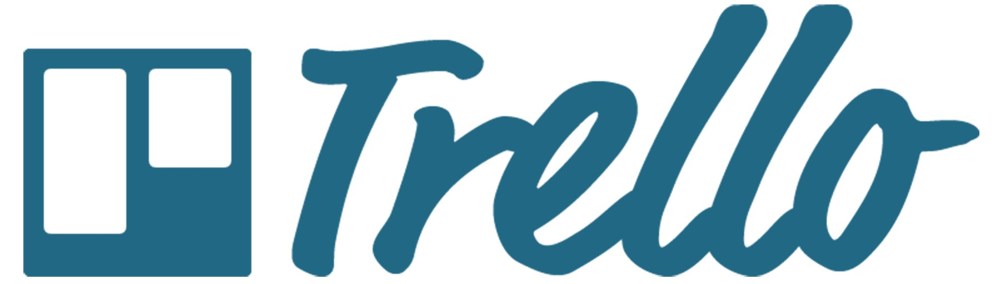

## ¿Qué es Trello?

Trello es una herramienta flexible para la gestión del trabajo, con la que los equipos pueden diseñar planes, colaborar en proyectos, organizar flujos de trabajo y hacer un seguimiento del progreso de una manera visual, productiva y gratificante.

**Ventajas de usar Trello**

+ Evita interrupciones de comunicación
+ Ahorra tiempo y optimiza la calidad del trabajo
+ Facilita el trabajo remoto
+ Automatización del trabajo
+ Compatibilidad con múltiples plataformas

## ¿Cómo usar Trello con el GV2050?

El equipo GV2050 posee su propio espacio de trabajo en Trello,
donde se puede acceder al mismo, haciendo click al enlace se muestra en la parte inferior. El/la staff designado como administrador de la cuenta de Trello del programa, aceptará la solicitud del invitado que requiere integrarse al workspace del programa. De esta manera, el nuevo integrante podrá observar el flujo de trabajo del equipo, aportar con información, informarse a cerca de actividades, aportar con ideas, entre otros.

Trello del GV2050:
[https://trello.com/b/roeajQ3g/galapagos-verde-2050-project](https://trello.com/b/roeajQ3g/galapagos-verde-2050-project)

Encontrarás mayor información con respecto al uso de Trello accediendo al siguiente enlace:
[https://blog.trello.com/es/como-usar-trello](https://blog.trello.com/es/como-usar-trello)